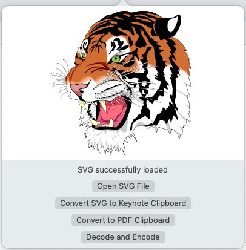
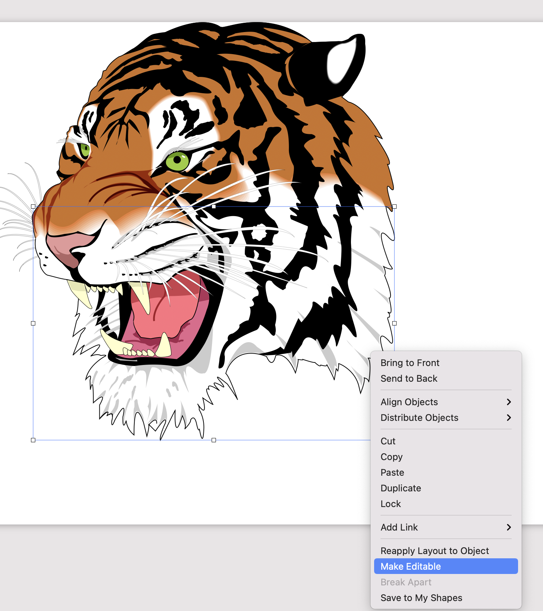
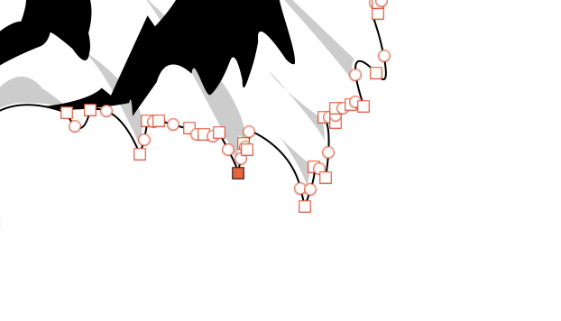
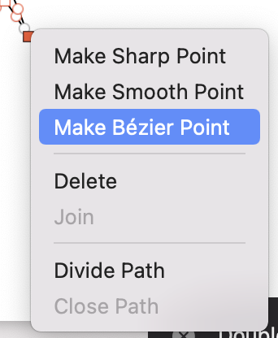
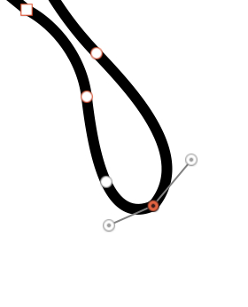

# KeynoteSVGUI Documentation

# Installation Process

## Prerequisites

- Install the protobuf shared library. This can be done as follows using brew:

```jsx
brew install protobuf
```

## Option 1 - Compile with Xcode (Best Choice)

First clone the repository:

```bash
git clone https://github.com/eth-siplab/SVG2Keynote-gui
```

Then just open the ".xcodeproj" file with Xcode and build. This will create your own signed `KeynoteSVGUI.app`, allowing the application to be run without any issues.

## Option 2 - Run the executable

[link to executable](bin/KeynoteSVGUI.app/Contents/MacOS/KeynoteSVGUI)

Download and run this executable from the command line. As this is then not packaged as a MacOS application, Apples signing security checks do not come into play.

## Option 3 - Run unsigned KeynoteSVGUI.app

[link to KeynoteSVGUI.app](bin/KeynoteSVGUI.app)

Due to Apple's Gatekeeping this option is tedious and not recommended.

### Appendage

It is possible, that you will have an issue due to the protobuf version of KeynoteSVGUI and the locally installed version not matching. Here it should suffice to create a symlink.

To do this you must find out the name of the installed ".dylib" for libprotobuf on your system. You can find this by running

```bash
find /usr/local/lib -name "libprotobuf.*"
```

Say for example you now find "/usr/local/lib/libprotobuf.30.dylib" in the results.

Next you need to find out what file is referenced by the KeynoteSVGUI executable.

Currently this is "/usr/local/lib/libprotobuf.26.dylib", but if this changes you can open the executable in a text editor and search for the path beginning in "/usr/local/lib/libprotobuf".

Once you have both of these values you can the run:

```bash
ln -s <installed_library> <referenced_library>
#In the above mentioned case:

ln -s /usr/local/lib/libprotobuf.30.dylib /usr/local/lib/libprotobuf.26.dylib
```

In the optimal case you would compile the software in Xcode from source, and then this issue should not arise.

# Using the tool

Once the app has launched you should see the following icon in your toolbar:


Once clicking on the icon you will be greeted with the following popover:




Here the UI should be pretty straightforward.

1. Use the button "Open SVG File" to select the file which you would like to insert into keynote.
2. Press "Convert SVG to Keynote Clipboard" to create a keynote clipboard.
3. After doing so the process should complete and you can now paste your SVG into Keynote in its native vector format using `CMD + V`

There are some shape types and SVG features which unfortunately do not yet work well with this new method. In this case you can use the button "Convert to PDF Clipboard", to convert the SVG into a PDF file, which can then similarly be pasted into your keynote document and scaled as you could any vector graphic. Unfortunately with this backup solution, you cannot edit the shape inside of keynote, as it is only recognised as a PDF file.

**Note: In order to use "Convert to PDF Clipboard", Inkscape must be installed. It was tested via homebrew installation of Inkscape:**

```bash
brew install inkscape
```

### Editing the inserted path

The main reason to use this tool, it to be able to edit vector graphics inside of Keynote's native file format. This isn't initially possible upon pasting.

First you must right click on a path and select "Make Editable":



Then you can see and move all of the nodes:



To be able to change the bezier curves, you can right click any node and select "Make Bézier Point", and then should be able to move the in and out Points.





# What works and what doesn't?

### Working

- Most different type of paths with stroke and fill style.
- Different types of line caps and line joins
    - Keynote supports these natively, but does not give the user access to create them in their GUI.
- Linear Gradients (partially)
    - It seems depending how the gradient is defined in SVG, it gets misinterpreted and the transformation vector can be off.

### Not yet working

- [Use elements](https://developer.mozilla.org/en-US/docs/Web/SVG/Element/use)
- Radial gradients
- Dash arrays
    - This is due to a limitation in Keynote's handling of "Stroke Patterns", which seems like it cannot be solved.
- Some shapes render incorrectly. Likely due to miscalculations in [NanoSVG](https://github.com/memononen/nanosvg) or scaling issues in the main [library](https://github.com/eth-siplab/SVG2Keynote-lib/)

# How was this tool created?

This tool is built upon the c++ library: [`SVG2Keynote-lib`](https://github.com/eth-siplab/SVG2Keynote-lib/), which I created for the underlying conversions take place. This c++ library uses the [NanoSVG](https://github.com/memononen/nanosvg) C library, from which some of the shortcomings stem from. 

NanoSVG does not support "Use" element in SVGs and seems to have some issues converting some shapes into their respective paths.

## Possible future developments

- [ ]  Drag-and-drop functionality
- [ ]  Get SVG from clipboard functionality
- [ ]  General code optimizations
- [ ]  Use a more advanced SVG parsing library.
